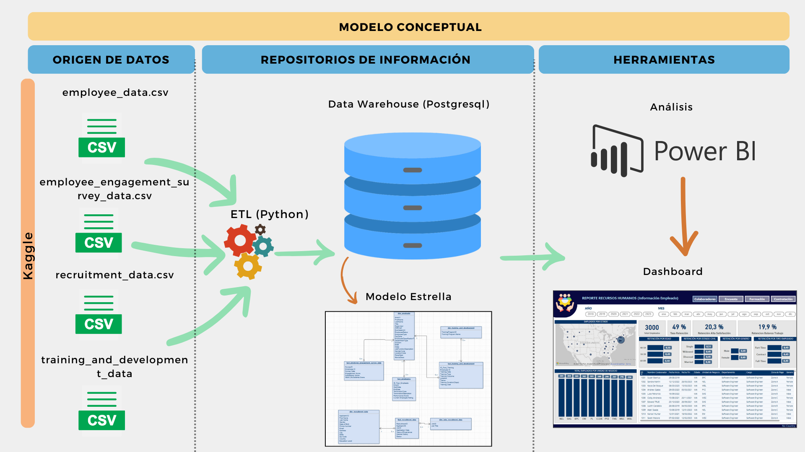
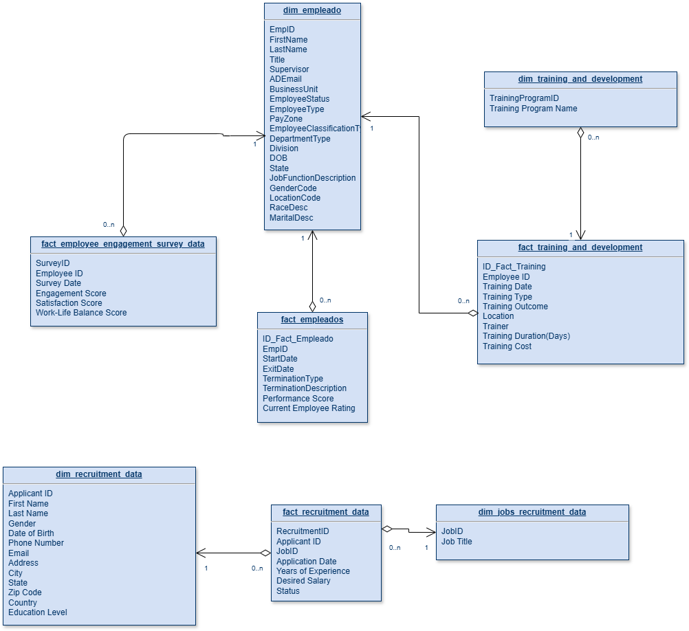

# C20-68-n-data-bi
# 📊 Análisis de Retención de Empleados

## 🏢 Industria o Rubro
**Recursos Humanos**

## 📄 Descripción
Este proyecto se centra en el análisis de datos de recursos humanos de una empresa para identificar factores que influyen en la retención de empleados y desarrollar estrategias de retención efectivas 

<div align="center">
  
</div>
- DataWareHouse Modelo Estrella
<div align="center">
  
</div>


## 👥 Team leader 
- **Andrés G Velasquez** - Team leader


## 👥 Colaboradores
- **Alejandra Moreno Vallejo** - Data Engineer
  - [](https://www.linkedin.com/in/alejandra-moreno-vallejo-4b1926138/)


## 💻 Tecnologías
- Python (Proceso de ETL)
  - Pandas 
  - SQLAlchemy 
- PostgreSQL (Para Nuestro DataWareHouse)
  - La base de datos fue desplegada en Render (https://dashboard.render.com/)
- Power BI (Dashboard)

## 🤖 Estructura del proyecto 
* 1_Source: Contiene los datos utilizados en el proyecto.
* 2_ETL: Contiene los archivos pyhton donde se realiza proceso de extraccion, limpieza y carga al datawarehouse realizado para el proyecto que se encuentra publicado en render en una base de datos postgresql
* 3_DataWareHouse: Contiene la estructura del DatawareHouse en sql.
* 4_DashboardPowerBI : Contiene el dashboard correspondiente a nuestro análisis

<div align="center">
  
</div>


## 📝 Instrucciones para Utilizar el Archivo Jupyter Notebook

1. Clonar el repositorio:
   ```bash
   git clone https://github.com/No-Country-simulation/C20-68-n-data-bi.git
